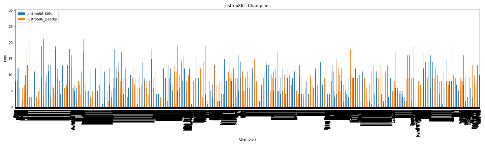

# General Idea

This project is to show the ability to use what was learned in class and apply it overall.

-Utilize data from an online computer game, League of Legends, to analyze player statistics.

-Import obtained data into a dataframe and clean it up.

-With MatPlotLib, create charts and/or plots to display the data and properly analyze it. 

-Ensure that the figures are properly exported for the ease of others to view it.

-Summarize the analysis.

# Brief Intro
This project utilized data obtained from an online computer game called "League of Legends". The data that was obtained was grabbed from two player's accounts, myself and another person. Each data set was downloaded and made into a .csv file in order to read the csv file and create a dataframe from the two files. From there, the files were combined into one large dataframe and had the headers cleaned up to coincide with the players. Since the combined dataframe had N/A values, those had to be dropped. The droppped N/A values became the final dataframe, which was sorted by champions (characters) in ascending alphabetical order. From there, the following questions were asked and answered:

# Between the two players, who has the better kill/death ratio?
The data for this question was pulled from two sets of the data. The first of the data contained the max kills and max deaths that each person had overall. The second set of data was pooled from the total amount of kills and deaths each person had. The first image below shows that while Umb12eon may have had the highest max kills, the person that had the lowest max number of deaths was Justrob86.
The second image displays the percentage of the overall kills and deaths each person had. The second image essentially shows more of what the first image did, where the person that has the most amount of kills (overall now) is still Umb12eon, yet the one with the least amount of deaths (overall) is Justrob86.

By looking at these two charts, the idea is while Umb12eon tends to get a lot of kills, Umb12eon gets more deaths. With that ratio, Umb12eon can be deemed as a below average player. Justrob86 on the other hand, the stats show that they are a somewhat decent player because they managed to keep their deaths below the amount of kills they obtain.

from IPython.display import Image
Image(filename = 'Images/Max_Kills_and_deaths.png')

from IPython.display import Image
Image(filename = 'Images/Total_Kills_and_deaths.png')

# -Using data from one champion, can the data show overall which person plays with that champion better?

This question came to mind because the idea was to see whether or not the stats from the overall kills/deaths would be applicable to just one champion(character) that each person played as. Initially, the attempt to look at the data was through a scatter plot. But, the scatter plots didn't convey the proper kills/deaths when the x-axis was the date the game was played; the kills/deaths didn't always pair up on the date and sometimes overlapped because of the chance that the champion was played on the same day. The next idea was to use box plots. Once the box plots were made, it could easily be seen that Justrob86 once again has better ratios for kills/deaths than Umb12eon does. The first box plot shows that Justrob86's average kills and deaths fall around 12 and 7. The second box plot shows that Umb12eon has the average kills and deaths falling around 9 and 9. Even though there were a few games where Umb12eon had an extraordinary amount of kills, Justrob86's data shows more consistency and thus proving that they play better with the chosen champion.

from IPython.display import Image
Image(filename = 'Images/Rob_Veigar_Stats_Boxplots.png')

from IPython.display import Image
Image(filename = 'Images/Umb_Veigar_Stats_Boxplots.png')

# -Can an overview of champion stats be displayed?

This question was a bit more difficult than the other two because trying to display the entire dataset on one graph took awhile for the kernel to process. The bar charts below show in general how each person did with their kills and deaths with each champion that was ever played. The orange bars in each chart display the deaths and the blue represent kills. It can be seen that in Umb12eon's chart, the orange bars tend to be a bit higher than the blue bars. Yet, in Justrob86's chart, the orange bars are mostly at or below the blue bars. This shows that while Umb12eon can get a bunch of kills under their belt, the amount of deaths are right up there. Justrob86 on the other hand, managed to keep the amount of kills at a decent level and has their deaths quite low.

https://github.com/aidixon/Project1/blob/main/Images/Justrob86_All_Champions.png

# Conclusion
Based on the overall data, it can be seen that although Umb12eon has the skills to get a lot of kills with the champion that is played, Umb12eon needs to be more diligent in not getting killed in order to make their kill/death ratio better. A similar conclusion can be made for Justrob86, while they have a decent kill/death ratio, it could be even better by trying to not die in the game. The idea that there is potential to be better has both players wanting to continue playing the game. 

